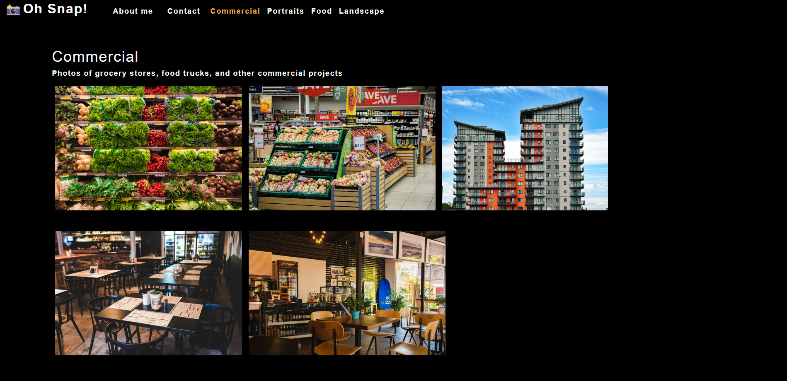
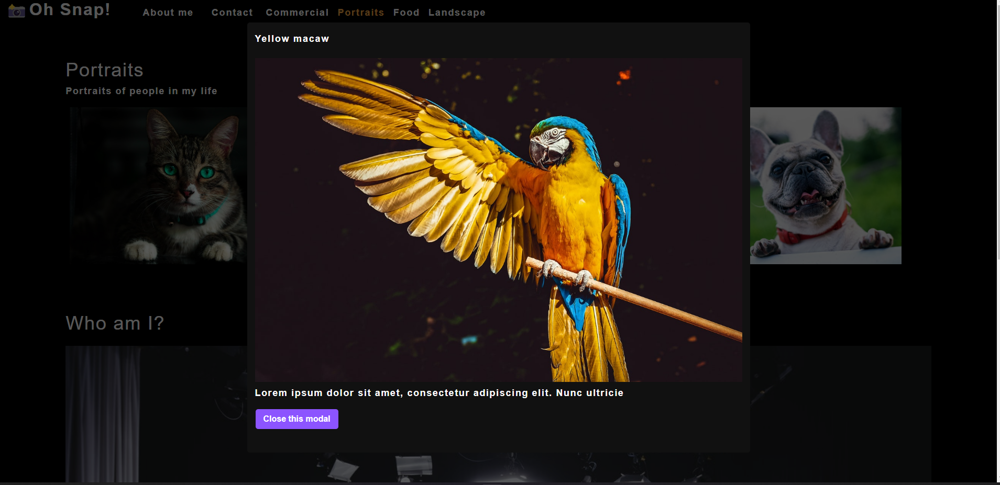
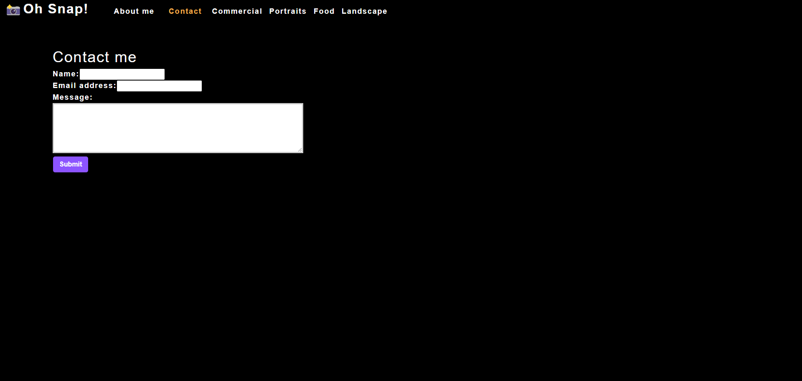

# Photo Port

  
## Description

A portfolio site for a photographer built using React. This site is a single page application that uses React state, props, Hooks, and reusable UI components to provide a simple and sleek platform for showing of photography skills.







## Table of Contents

- [Installation](#installation)
- [Usage](#usage)
- [License](#license)
- [Contributing](#contributing)
- [Tests](#tests)
- [Questions](#questions)

## Usage

Navigate to the [Website](http://realnifty.github.io/photo-port) to view photos by category, click on a photo to view a large version of it, and click on the contact section to create a message to the author.

## Installation

This application requires NodeJS to run. Clone this repository to your local machine and run ```npm i``` to install required dependencies, then run ```npm start``` to initialize the server/database. The application may then be accessed in localhost.

## License
    
Licensed under the [MIT License](https://spdx.org/licenses/MIT.html)

## Contributing

No contributions to be accepted at this time.

## Tests

No further testing is planned for this project at this time.

## Questions

Have questions? Reach me at the following sources!

* GitHub: [realnifty](https://github.com/realnifty)
* E-mail: lovecore@pm.me